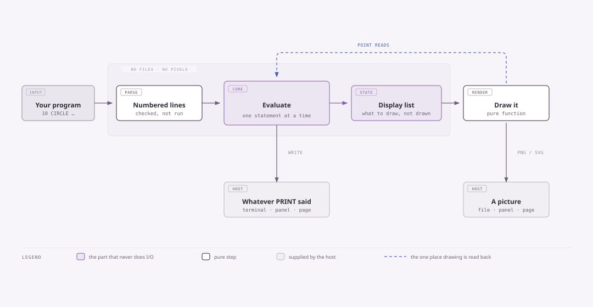
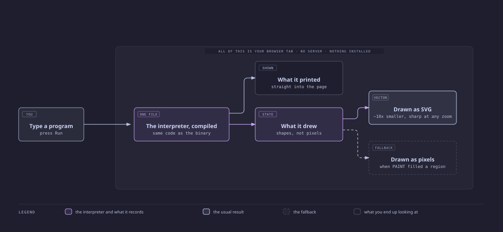
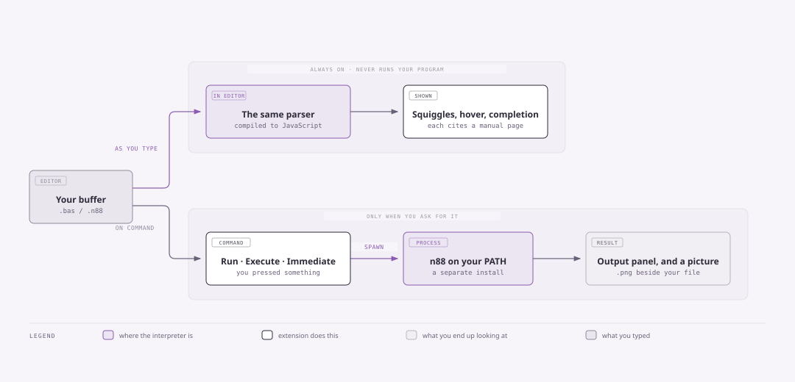

# n88basic

An interpreter for **N88-BASIC(86)**, the BASIC that shipped in ROM on NEC's
PC-9801, together with a specification written from NEC's own reference
manual and a VS Code extension for editing programs.

```basic
10 CLS 3
20 FOR I = 7 TO 1 STEP -1
30   CIRCLE (320, 100), I * 12, I
40   PAINT (320, 100), I, I
50 NEXT I
```

```
$ n88 rings.bas
wrote rings.png
```

Programs that draw leave a PNG beside the source. Programs that only print
behave like any other command-line tool.

## Why it exists

Vintage BASIC listings are easy to find and hard to run. Emulating the whole
machine is one answer; this is the other — run the *language*, faithfully
enough that a listing from the period produces the output it was written to
produce, on a modern desktop, with no ROM image and no emulator.

"Faithfully" is the hard part, and it is why this repository contains a
specification as well as an interpreter.

## How it works



The core opens no file and touches no pixel. It calls back to whoever is hosting
it for text and input, and *records* drawing as a display list that a separate
renderer turns into a PNG or an SVG. That is why the same interpreter runs
unchanged in a terminal, in VS Code, and in a browser tab.

## Quick start

```sh
curl -fsSL https://raw.githubusercontent.com/sajonaro/n88basic/main/install.sh -o install.sh
sh install.sh            # again later to upgrade; prints what it replaced
n88 rings.bas            # a program that draws leaves rings.png beside it
```

Add `--extension` for the VS Code extension. Flags and variables:
[Reference](#reference).

Or run it with nothing installed:

```sh
docker run --rm -v "$PWD:/work" ghcr.io/sajonaro/n88basic rings.bas
```

**From source**, with OCaml 5 and dune:

```sh
make build && make test
scripts/install-from-source.sh
```

`opam pin add n88basic 'git+https://github.com/sajonaro/n88basic.git#v0.2.0'`
is the only route that gives you the library rather than the command. Pin a
tag; it is not on the opam repository.

## Using it as a container

Mount the directory holding your programs; a drawing lands beside its source.

```sh
docker run --rm -v "$PWD:/work" ghcr.io/sajonaro/n88basic rings.bas
echo "Ada,36" | docker run --rm -i -v "$PWD:/work" ghcr.io/sajonaro/n88basic ask.bas
```

`:0.2.0` and `:0.2` pin a version, `:latest` follows the newest. The image
carries the interpreter alone.

## What works

93 keywords, and the whole expression language: the numeric type tower
(integer, single, double, with the manual's own coercion rules), string
functions, control flow including labels, `DATA`/`READ`/`RESTORE`, error
handling with `ON ERROR`/`RESUME`/`ERR`/`ERL`, `PRINT USING`'s full format
language, and graphics — `PSET`, `PRESET`, `LINE` with box and style-mask
forms, `CIRCLE`, `PAINT` with tile patterns, and the colour palette,
rendered to a 640×400 framebuffer and written out as PNG with no image
library.

## One thing that looks like a bug

```basic
PRINT 1000000      '  1E+06     seven digits -> single precision
PRINT 10000000     '  10000000  eight digits -> double precision
A = 10000000
PRINT A            '  1E+07     but a plain VARIABLE is single
```

A constant takes its type from how many digits you wrote (printed pp.13–14);
a variable with no suffix is single precision whatever you assign to it
(printed p.14). Single has a six-digit display budget, double has sixteen.

So a total accumulated into a plain variable goes exponential once it passes
six digits. Write `T#`, or `DEFDBL T`, when you want the full form. This is the
machine's behaviour, not ours — `NUM.TYPES` in `spec/clauses.json` carries the
pages.

## Scripting around it

Program output goes to **stdout**; diagnostics and the `wrote <file>.png`
notice go to **stderr**. Keep them separate — merging them with `2>&1` is
order-unstable as soon as a program draws, and differently so under Docker.

## What it deliberately does not do

- **No text screen.** `LOCATE`, `CONSOLE` and `CLS 1` parse and record their
  arguments but have no character grid to act on. Output is a stream, not a
  screen.
- **No files, sound, or machine-level access.** `OPEN`/`CLOSE`, `BEEP`,
  `PEEK`/`POKE`/`CALL`, `INP`/`OUT` and the interrupt statements are out of
  scope. A program using one is told so by name rather than misbehaving.
- **One screen mode and one graphics page**, in the default eight-colour
  palette mode.

Every one of these is recorded in `spec/spec.md` §3 with its reason, so the
boundary is a decision on the record rather than a gap someone forgot.

## Reference

Everything that takes an option, in one place.

### `n88` — running a program

```
n88 FILE.bas            run a file
n88 -                   run a program read from stdin
n88 --immediate         a live session: type statements, keep the variables
```

| Option | |
| --- | --- |
| `--svg` | draw into `FILE.svg` instead of `FILE.png` — vector, usually ~10× smaller. `PAINT` and tile fills have no vector form and embed a raster instead, which it tells you |
| `--immediate`, `-i` | the manual's direct mode: statements run as you type them and their variables persist. Numbered lines are stored instead; `RUN`, `LIST` and `NEW` work at the prompt |
| `--uninstall` | remove this binary and list what else came with n88. Add `--yes` to skip the confirmation |
| `--version` | print the version and exit |
| `--help` | print the usage and exit |

A program that draws leaves a picture beside its source — `hello.bas` → `hello.png`.
A program read from stdin has no source to sit beside, so it draws into `n88.png`
in the working directory, and `INPUT` then has nothing to read.

### `install.sh` — installing and upgrading

The same command installs and upgrades; run it again whenever.

| Option | |
| --- | --- |
| `--extension` | also install the VS Code extension from the release |
| `--uninstall` | remove the binary, and list what else is on the machine |
| `--yes`, `-y` | skip the confirmation on `--uninstall` |

| Variable | Default | |
| --- | --- | --- |
| `PREFIX` | `~/.local` | where `n88` goes — the binary lands in `$PREFIX/bin` |
| `VERSION` | `latest` | pin a release, e.g. `VERSION=v0.2.0` |

### `make` — working on it

| Target | |
| --- | --- |
| `build` | the interpreter |
| `test` | every gate: unit suites, conformance, spec, invariants |
| `web` | build the browser console and check it runs the corpus |
| `webconsole`, `wc` | build it and serve it on `localhost:8088` (`PORT=…` to change). Docker serves it, and builds it too when `js_of_ocaml` is missing |
| `install` | put `n88` on your PATH from this checkout |
| `extension` | package the VS Code extension |
| `clean` | remove build output |

### The container

```sh
docker run --rm -v "$PWD:/work" ghcr.io/sajonaro/n88basic prog.bas
```

`scripts/n88-docker` wraps this as a plain executable, so anything that can run
`n88` can drive the image instead — including the editor's `interpreterPath`.
Set `N88_IMAGE` to pin a tag.

### The extension

Two settings, `n88basic.interpreterPath` and `n88basic.languageServer`, both
described in [the extension's own guide](editor/vscode/README.md) along with its
commands and keybinding.

## The specification

`spec/` is the interesting part: a machine-checked description of the dialect
whose central rule is

> **No clause without a citation.** Every rule names the page of NEC's manual it
> came from, and `tools/check_spec.py` fails if one does not.

Writing down what the interpreter *happens to do* produces a document that
cannot disagree with the code, and so cannot find a bug in it. Several real
defects here were found by reading a page and seeing the interpreter contradict
it. Where the manual is silent the interpreter still has to do something, and
those choices are marked as ours rather than presented as the dialect's.

| | |
| --- | --- |
| `spec/spec.md` | scope, and what is deliberately excluded |
| `spec/clauses.json` | every clause, cited, with a status |
| `spec/keywords.json` | the keyword inventory and its syntax |
| `spec/errors.json` | the error catalogue |
| `spec/sources.md` | the sources, and how far each is trusted |

`tools/` holds the checkers — coverage, the structural gate, uncited manual
pages, and the example programs. `make test` runs them.

## Removing it

```sh
sh install.sh --uninstall          # or: n88 --uninstall
```

Removes the binary and lists what it did not install — the extension, container
images, an editor setting — with the command for each. n88 writes no config,
cache or state directory, so that list is the whole of it.

## Versions

The interpreter and the extension ship under one tag and carry the same version,
so extension X.Y.Z expects `n88` X.Y.Z. A newer interpreter is fine; an older
one the extension notices and tells you about.

Every release bumps the **minor** component — `v0.1.4` is followed by `v0.2.0`,
never `v0.1.5` — enforced by `tools/check_version_bump.py` before anything is
built.

## In a browser

```sh
make wc          # http://localhost:8088 — stays running until Ctrl-C
```



Docker is the only thing you need: it serves the console, and builds it too
when `js_of_ocaml` is missing. The build runs the conformance corpus through
the JavaScript build first, so the page provably runs the same language as the
binary.

Drawings arrive as vectors, about ten times smaller than the PNG and sharp at
any zoom. `n88 --svg` writes the same from the command line.

The console is four static files; `make web` puts them in `web-console/` for
any static host to serve.

## The VS Code extension



Syntax highlighting, live diagnostics, hover documentation from the spec data,
completion, quick fixes, renumbering, and commands to run a buffer, a selection,
or a single statement in a live session.

```sh
code --install-extension n88basic.n88basic
```

In a remote window — WSL, SSH, a dev container — install it and `n88` **on the
remote**. [Full guide](editor/vscode/README.md).

## Licence

MIT — see [`LICENSE`](LICENSE).

## Sources

The dialect is specified from primary documentation. All four sources are
listed with links and per-page provenance in [`spec/sources.md`](spec/sources.md).

- **N88-BASIC(86) Reference Manual**, NEC, 1982 — the primary source
  ([archive.org](https://archive.org/details/N88BASIC86Manual))
- **PC-9801 N88(86)BASIC command index**
  ([openspc2.org](http://www.openspc2.org/BASIC/HTML/PC-9801%5BN88\(86\)BASIC%5D.html))
- **PC-8801 N88-BASIC入門** — a different machine in the same family, used
  only for orientation ([archive.org](https://archive.org/details/PC8801N88BASIC))
- **PC-8801 N88-BASIC解析マニュアル**, 川村清 — third-party analysis of
  interpreter internals ([archive.org](https://archive.org/details/PC-8801N88-BASIC))

The manuals themselves are not redistributed here. Citations name the printed
page so a reader can follow them in their own copy.

N88-BASIC is a trademark of NEC Corporation. This project is not affiliated
with or endorsed by NEC.

## Layout

```
basic/    the interpreter: lexer, parser, evaluator — no I/O of its own
raster/   display list to a picture: framebuffer, PNG, SVG, no dependencies
bin/      the n88 command-line runner
web/      the browser console — the same libraries, compiled to JavaScript
editor/   the VS Code extension and its checker
spec/     the cited specification and its data
test/     unit tests, conformance cases, example programs
tools/    the checkers: spec, coverage, browser build, SVG, deflate
docs/     design notes, the diagrams above, and the manual scans (untracked)
```

`basic/` performing no I/O is load-bearing rather than tidy: it is what lets the same code be
the command-line interpreter, the editor's checker, and the browser console. An invariant in
`scripts/check-invariants.sh` enforces it.
