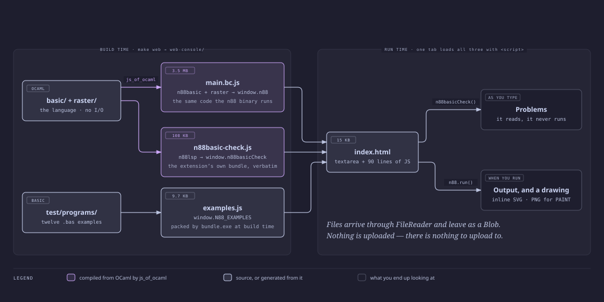

# The web console

N88-BASIC(86) running in a browser tab: the same interpreter as the `n88`
command, compiled to JavaScript. There is no server, no account and no upload
— the program you type is run by code already in the page.

```sh
make wc              # http://localhost:8088, until Ctrl-C
make wc PORT=8099    # somewhere else
```

Docker is the only thing you need. It serves the console, and builds it too
when `js_of_ocaml` is missing.



## What it does

- **Colour and problems as you type.** Both come from the interpreter's own
  lexer and checker, exported from the bundle the VS Code extension ships, so
  the editor and the page cannot disagree about what parses. The checker reads
  and never runs — that is what makes it safe on every keystroke.
- **Drawings as vectors.** `CIRCLE`, `LINE` and `PSET` become SVG, roughly a
  tenth the size of the PNG and sharp at any zoom. `PAINT` and tile fills have
  no vector form and arrive as an embedded raster instead, which the page
  says.
- **Files in and out.** Open or drop a `.bas`; anything else becomes the input
  `INPUT` reads. Save the program, the output, the SVG or the PNG. FileReader
  reads and a Blob writes, both in the browser.

## What it is made of

| | | |
| --- | --- | --- |
| `index.html` + `console.css` | 20 KB | the page: one `<textarea>` and ~90 lines of JS |
| `main.bc.js` | 3.5 MB | `basic/` + `raster/` → `window.n88` |
| `n88basic-check.js` | 108 KB | `editor/lsp/` → `window.n88basicCheck`, `window.n88basicTokens` |
| `examples.js` | 9.7 KB | `test/programs/` → `window.N88_EXAMPLES`, packed at build time |

Two bundles rather than one, because reading a program and executing it are
different questions and only one of them is safe to ask on every keystroke.

`main.ml` is the whole of the OCaml here — it hands the interpreter a string
and collects what comes back. Everything it calls lives in `basic/` and
`raster/` and knows nothing about browsers.

## Hosting it somewhere else

```sh
make web          # writes web-console/
```

Five static files with no server behind them, so any static host will do —
GitHub Pages, S3, nginx, a directory on a laptop. `make wc` is that directory
plus a container to serve it from.

**Why a directory and not a Docker volume.** The directory *is* the product:
`make web` exists to hand you files you can put somewhere. A volume would put
them where only Docker can reach them, and getting them out would mean a
container and a copy — the step the volume was meant to save. It would also
hide the deliverable behind a concept you would have to learn to collect your
own build.

The serving container gets those files by `docker cp` rather than `-v`.
`-v` hands the *daemon* a path and asks it to find that directory, which works
only when the daemon shares a filesystem with you and fails quietly when it
does not — a remote `DOCKER_HOST`, a Desktop VM without this directory shared.
Each mounts an empty directory and serves a 403 with nothing to say why.

## Checking it

`make web` runs the whole conformance corpus through the JavaScript build
before it copies anything: 101 cases, drawings compared byte for byte against
the same PNG hashes the native binary is held to. The page provably runs the
same language as the command line, or the build fails.
